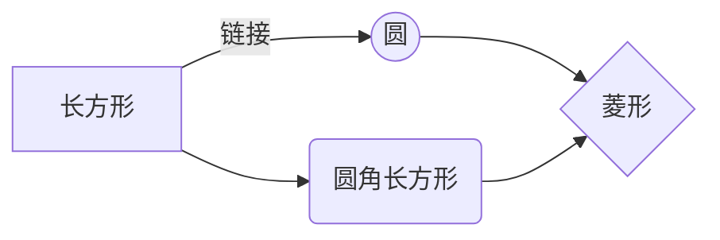

# css定位
## 基础布局
基础布局通常使用div+css布局。  
1. 水平居中：
```css
div{
    text-align: center;
}
```
2. 垂直居中有四种方案：
    1. 设置父元素为table样式,并指定确切高度，子元素为table-cell，，vertical-align属性为middle。
    ```css
    .father{
        display: table;
        text-align: center;
        width: 100%;
        height: 200px;
    }
    .son{
        display: table-cell;
        vertical-align: middle;
    }
    ```  
    2. 设置文字的高度与列高一样。
    3. 设置display为box，box-align为center和box-pack为center。
    > 需要考虑兼容问题。  
    ```css
    .father{
        width: 100%;
        height: 200px;
        text-align: center;
        /* google,android,edge... */
        display: -webkit-box;
        -webkit-box-align: center;
        -webkit-box-pack: center;
        /* fixfox */
        display: -moz-box;
        -moz-box-align: center;
        -moz-box-pack: center;
    }
    ```
    4. 设置父元素为相对定位，子元素为绝对定位。
    ```css
    .father{
        position: relative;
        width: 100%;
        height: 200px;
    }
    .son{
        position: absolute;
        top: 50%;left: 50%;
        transform: translate(-50%,-50%);
    }
    ```

## flex
flexible box 弹性布局，是W3C标准新方案。可快速搭建响应式布局，flex已成为主流布局方案。  
```css
div{
    dispaly: flex;
}
```
父元素设置为flex，成为flex容器。其下子元素成为容器成员。  
flex布局基本依靠容器和轴（主轴，交叉轴）。
### 容器属性
1. flex-direction。设置容器主轴方向。

2. 


## grid


